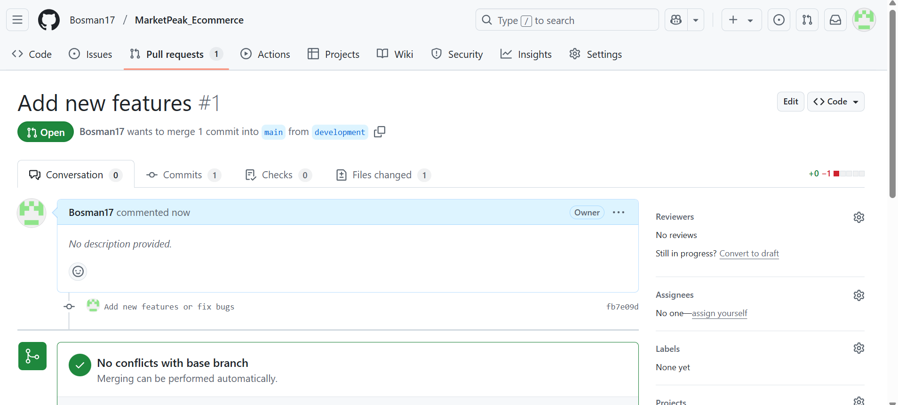

# CAPSTONE PROJECT- INTRODUCTION TO CLOUD COMPUTING

## MarketPeak_Ecommerce

__Step 1:__ Initializing Git Repository by using command; mkdir

__Step 2:__ Local Website Development

__Step 3:__ Staging and Committing of the template to Git with:
git add .
git config --global user.name "YourUsername"
git config --global user.email "youremail@example.com"
git commit -m "Initial commit with basic e-commerce site structure"

__Step 4:__ The code was pushed to the Github repository using: git remote add origin https://github.com/your-git-username/MarketPeak_Ecommerce.git and git push -u origin main

__Step 5:__ AWS Deployment: I created an EC2 Intance on my AWS as seen below.

__Step 6:__ I then cloned the repository on the linux server using SSH.

I got my SSH key using ssh-keygen to get my public key

Which was later added to my Github account.

__Step 7:__ I installed a web server on my Ec2 instance using sudo yum update -y
sudo yum install httpd -y
sudo systemctl start httpd
sudo systemctl enable httpd

__Step 8:__ I Confirgured httpd for website using sudo rm -rf /var/www/html/*
sudo cp -r ~/MarketPeak_Ecommerce/* /var/www/html/

Our Website

__Step 9:__ Continous Integration and Deployment Workflow

Version Control with Git: New Features was added using git add .
git commit -m "Add new features or fix bugs"
git push origin development

__Step 10:__ Pull Request and Merging to the same branch using git checkout main
git merge development
git push origin main
git pull origin main

Then We have our changes reflected.

THANK YOU
